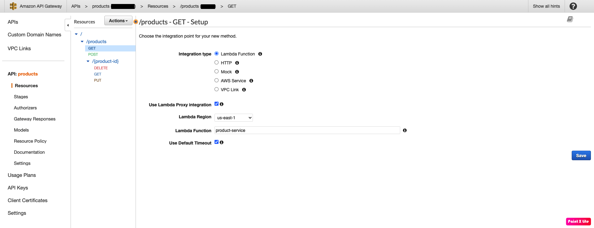
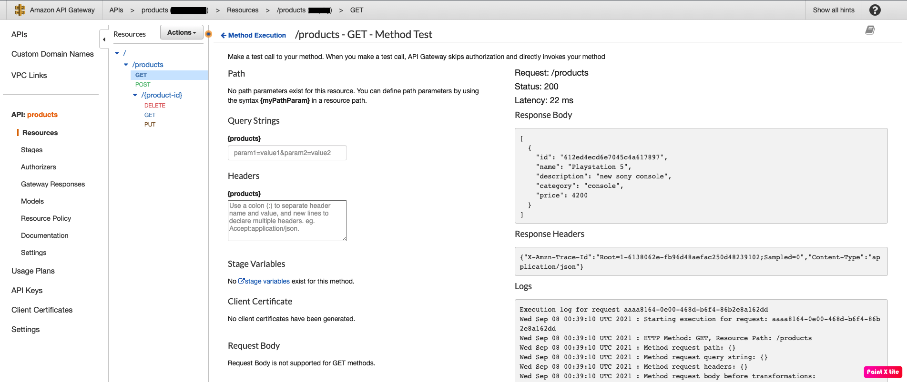
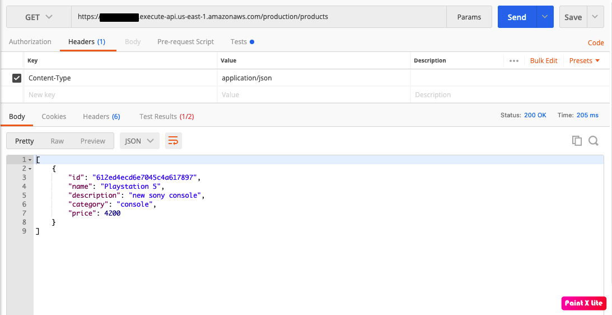

# product-serverless-service
Sample serverless application using Micronaut, AWS Lambda and API Gateway

- [x] [Micronaut 2.5.11](https://micronaut.io/)
- [x] [SAM](https://aws.amazon.com/pt/serverless/sam/) 
- [x] MongoDB
- [x] TestContainers
- [x] Java 11


### Endpoints


### Build Application
```console
product-serverless-service % ./gradlew build
```

### Start Application
This command starts the docker containers, sam local api and build the project.
```console
product-serverless-service % make run
```

### Debug Application

1 - Configure intellij remote debugging.


2 - Execute this command
```console
product-serverless-service % make debug
```
3 - Send request

4 - Start debug


### Create lambda function

1 - Create a lambda function in aws console using Java 11 Corretto runtime.


2 - Execute the gradle build and upload the jar located on build/libs path.


3 - Configure the function handler using MicronautLambdaHandler.


4 - Add an environment variable with the mongodb url.
In this project I used [mongodb atlas](https://www.mongodb.com/cloud/atlas/lp/try2?utm_content=controlaterms&utm_source=google&utm_campaign=gs_americas_brazil_search_core_brand_atlas_desktop&utm_term=mongodb%20atlas&utm_medium=cpc_paid_search&utm_ad=e&utm_ad_campaign_id=12212624308&gclid=Cj0KCQjwm9yJBhDTARIsABKIcGb7tWpZ2K79iVRFJ0R24w2B83dPmq9qzovbQiphRB9O60u45tjlXDQaApVYEALw_wcB). Like amazon, they offer a database in free tier.


5 - Finally, you can send a api gateway event to the function and see the result.


### Create api gateway

1 - Create an api gateway of rest api type.

2 - Map methods and resources like product controller.

3 - For each method, select lambda function and enable lambda proxy integration.


4 - After that, you can test your functions.


5 - At last, after deploy your api gateway, it will be avaliable to access.

