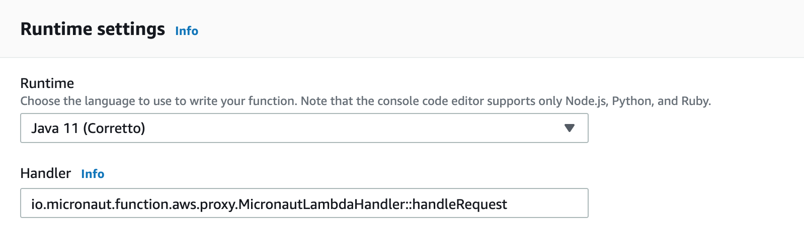

# product-serverless-service
Sample serverless application using Micronaut, AWS Lambda and API Gateway

- [x] [Micronaut 2.5.11](https://micronaut.io/)
- [x] [SAM](https://aws.amazon.com/pt/serverless/sam/) 
- [x] MongoDB
- [x] TestContainers
- [x] Java 11


### Endpoints


### Build Application
```console
product-serverless-service % ./gradlew build
```

### Start Application
This command starts the docker containers, sam local api and build the project.
```console
product-serverless-service % make run
```

### Debug Application

1 - Configure intellij remote debugging.


2 - Execute this command
```console
product-serverless-service % make debug
```
3 - Send request

4 - start debug


### Create lambda function

1 - Create a lambda function in aws console using Java 11 Corretto runtime.


2 - Execute the gradle build and upload the jar located on build/libs path.


3 - Configure the function handler using MicronautLambdaHandler.


4 - Add an environment variable with the mongodb url.
In this project I used mongodb atlas. Like amazon, they offer a free tier database.


5 - Finally, you can send a api gateway event to the function and see the result.


### Configure api gateway


